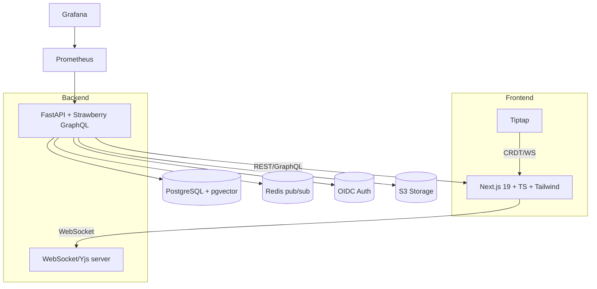
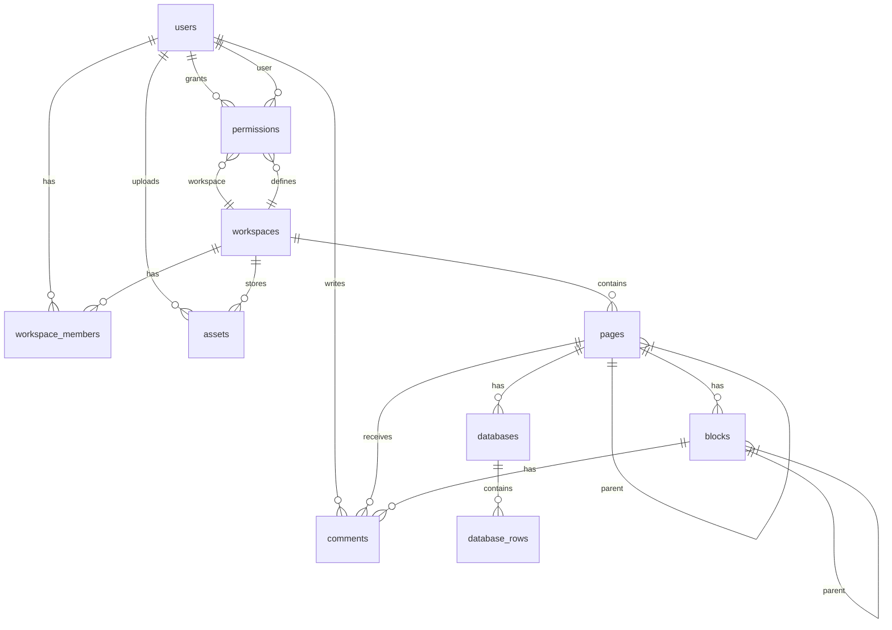

# NovaDocs Architecture Specification

## Overview
NovaDocs is a self-hosted, collaborative wiki platform designed for teams. It combines hierarchical documentation with real‑time editing and structured databases. This document outlines the key architecture, API schema, code snippets, dev‑ops setup and roadmap for the project.

## High-level Architecture


## Monorepo Structure
```
/novadocs
  /apps
    /frontend     # Next.js application
    /backend      # FastAPI application
  /packages
    /shared       # Shared TS/py utilities
  /infrastructure
    /docker/development  # Local compose stack
```

## Entity Relationship Diagram


## GraphQL Schema (excerpt)
```graphql
scalar UUID
scalar JSON

input CreatePageInput {
  title: String!
  workspaceId: UUID!
  parentId: UUID
  position: Int
  isTemplate: Boolean
}

input UpdatePageInput {
  title: String
  slug: String
  metadata: JSON
  contentYjs: String
  position: Int
  isTemplate: Boolean
}

type Page {
  id: UUID!
  title: String!
  slug: String!
  workspace: Workspace!
  parent: Page
  children: [Page!]!
  blocks: [Block!]!
  createdBy: User!
  metadata: JSON
  contentYjs: String
  position: Int!
  isTemplate: Boolean!
  createdAt: String!
  updatedAt: String!
}

type Query {
  me: User
  page(id: UUID!): Page
}

type Mutation {
  createPage(input: CreatePageInput!): Page!
  updatePage(id: UUID!, input: UpdatePageInput!): Page!
  deletePage(id: UUID!): Boolean!
}

type Subscription {
  pageUpdated(pageId: UUID!): Page!
}
```

### REST Examples
Health check:
```http
GET /health
```
File upload:
```http
POST /api/v1/upload
Content-Type: multipart/form-data
```

## Key Code Samples
### 1. Yjs WebSocket server (FastAPI)
```python
# apps/backend/src/api/websocket/yjs_server.py
from fastapi import FastAPI, WebSocket
from ypy_websocket import WebsocketServer

app = FastAPI()
ws_server = WebsocketServer()

@app.websocket("/yjs/{doc_id}")
async def yjs_endpoint(websocket: WebSocket, doc_id: str):
    await ws_server.serve(websocket, doc_id)
```

### 2. Tiptap DatabaseView node extension
```typescript
// apps/frontend/src/components/editor/extensions/DatabaseView.ts
import { Node, mergeAttributes } from '@tiptap/core'

export const DatabaseView = Node.create({
  name: 'databaseView',
  group: 'block',
  atom: true,
  addAttributes() {
    return {
      databaseId: { default: null },
      view: { default: 'table' }
    }
  },
  parseHTML() { return [{ tag: 'div[data-database-view]' }] },
  renderHTML({ HTMLAttributes }) {
    return ['div', mergeAttributes(HTMLAttributes, { 'data-database-view': '' }), 0]
  }
})
```

### 3. Alembic migration for Pages & Blocks
```python
# apps/backend/src/migrations/001_initial_schema.py
op.create_table(
    'pages',
    sa.Column('id', postgresql.UUID(as_uuid=True), primary_key=True, default=uuid.uuid4),
    sa.Column('title', sa.String(500), nullable=False),
    sa.Column('slug', sa.String(200), nullable=False),
    sa.Column('workspace_id', postgresql.UUID(as_uuid=True), sa.ForeignKey('workspaces.id', ondelete='CASCADE'), nullable=False),
    sa.Column('parent_id', postgresql.UUID(as_uuid=True), sa.ForeignKey('pages.id', ondelete='CASCADE')),
    sa.Column('created_by_id', postgresql.UUID(as_uuid=True), sa.ForeignKey('users.id', ondelete='CASCADE'), nullable=False),
    sa.Column('position', sa.Integer, default=0, nullable=False),
)

op.create_table(
    'blocks',
    sa.Column('id', postgresql.UUID(as_uuid=True), primary_key=True, default=uuid.uuid4),
    sa.Column('page_id', postgresql.UUID(as_uuid=True), sa.ForeignKey('pages.id', ondelete='CASCADE'), nullable=False),
    sa.Column('type', sa.String(50), nullable=False),
    sa.Column('data', postgresql.JSONB(), default={}, nullable=False),
    sa.Column('position', sa.Integer, default=0, nullable=False),
    sa.Column('parent_block_id', postgresql.UUID(as_uuid=True), sa.ForeignKey('blocks.id', ondelete='CASCADE')),
)
```

### 4. React `usePage` hook
```typescript
// apps/frontend/src/hooks/usePage.ts (excerpt)
export function usePage(pageId: string) {
  const queryClient = useQueryClient()
  const { subscribe, send } = useWebSocket()

  const updatePageMutation = useMutation({
    mutationFn: async (input: UpdatePageInput) => {
      return graphqlClient.request(`mutation UpdatePage($id: UUID!, $input: UpdatePageInput!) { updatePage(id: $id, input: $input) { id updatedAt } }`, { id: pageId, input })
    },
    onSuccess: (data) => {
      queryClient.setQueryData(['page', pageId], prev => ({ ...prev, ...data.updatePage }))
      send('page_updated', { pageId, updates: data.updatePage })
    }
  })
  // offline queue + optimistic update logic ...
}
```

## Dev‑Ops
### docker-compose (development)
```yaml
version: '3.8'
services:
  postgres:
    image: pgvector/pgvector:pg16
    ports: ['5432:5432']
    environment:
      POSTGRES_DB: novadocs
      POSTGRES_USER: novadocs
      POSTGRES_PASSWORD: novadocs
  redis:
    image: redis:7.2-alpine
    ports: ['6379:6379']
  minio:
    image: minio/minio:latest
    ports: ['9000:9000', '9001:9001']
    command: server /data --console-address ":9001"
  keycloak:
    image: quay.io/keycloak/keycloak:22.0
    ports: ['8080:8080']
    command: start-dev
```

### CI Pipeline (GitHub Actions)
- Install Node and Python
- Run linters (`eslint`, `black`, `isort`)
- Run tests (`npm test`, `pytest`)
- Build Docker images and push
- Apply Alembic migrations

## Security & Scaling Notes
- Sanitize user input to prevent XSS
- CSRF protection on mutations
- Role-based permissions checked server-side
- Rate limit WebSocket and REST endpoints
- For multi-node, run multiple WebSocket servers behind a load balancer with sticky sessions or use NATS for awareness broadcast

## Adoption Roadmap
### MVP (first 90 days)
1. Basic auth with OIDC
2. Page hierarchy with editor and CRDT sync
3. Database/table pages
4. File uploads to S3/MinIO
5. Search (text + vector)

### Phase 2
- Mobile React Native client
- AI summarization of pages
- Plugin marketplace
